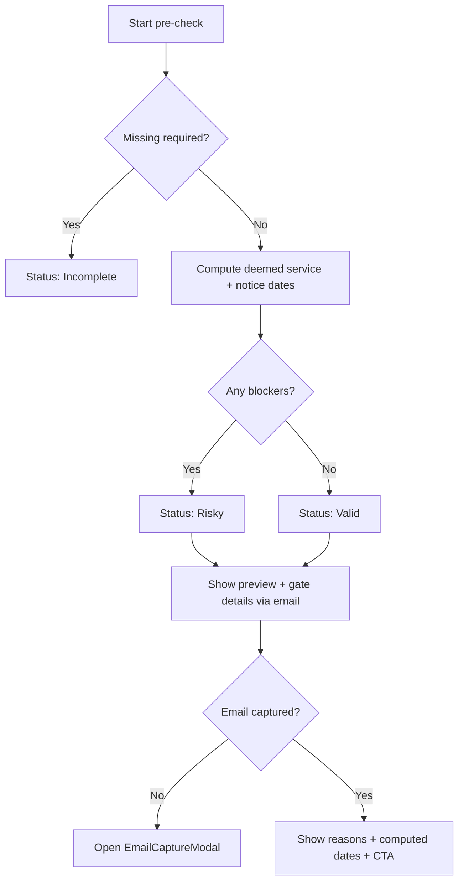

# Section 21 pre-check (standalone) — compliance + timing

This document describes the standalone Section 21 pre-check implementation for the Notice Only product page. It is a product guidance feature and **not legal advice**.

## Foundational sources

1. GOV.UK Section 21/8 overview: https://www.gov.uk/evicting-tenants/section-21-and-section-8-notices
2. Housing Act 1988 s.21: https://www.legislation.gov.uk/ukpga/1988/50/section/21/data.html
3. s.21A / s.21B:
   - https://www.legislation.gov.uk/ukpga/1988/50/section/21A/2021-11-03/data.html
   - https://www.legislation.gov.uk/ukpga/1988/50/section/21B/data.html
4. SI 2015/1646 Reg 2 + PDF:
   - https://www.legislation.gov.uk/uksi/2015/1646/regulation/2/data.html
   - https://www.legislation.gov.uk/uksi/2015/1646/pdfs/uksi_20151646_en.pdf
5. Housing Act 2004 deposit rules:
   - https://www.legislation.gov.uk/ukpga/2004/34/section/213/2025-10-27/data.html
   - https://www.legislation.gov.uk/ukpga/2004/34/section/215/2025-01-01/data.html
6. Housing Act 2004 licensing bars:
   - https://www.legislation.gov.uk/ukpga/2004/34/section/75/data.html
   - https://www.legislation.gov.uk/ukpga/2004/34/section/98/data.html
7. GOV.UK May 2026 transition guidance:
   - https://www.gov.uk/guidance/renting-out-your-property-guidance-for-landlords-and-letting-agents/giving-notice-to-evict-tenants
8. CPR deemed service summary:
   - https://assets.publishing.service.gov.uk/media/5ffed7ccd3bf7f65d55056f5/Certificates_of_Service.pdf
9. GOV.UK bank holidays API:
   - https://www.gov.uk/bank-holidays.json

## Input keys

| Key | Type |
|---|---|
| jurisdiction | 'england' |
| landlord_type | 'private_landlord'\|'social_provider'\|'unsure' |
| tenancy_start_date | string |
| is_replacement_tenancy | yes/no/unsure |
| original_tenancy_start_date | string\|null |
| tenancy_type | 'fixed_term'\|'periodic'\|'unsure' |
| fixed_term_end_date | string\|null |
| has_break_clause | yes/no/unsure |
| break_clause_earliest_end_date | string\|null |
| rent_period | weekly/fortnightly/four_weekly/monthly/quarterly/yearly/other/unsure |
| planned_service_date | string |
| service_method | hand/first_class_post/document_exchange/email/other/unsure |
| service_before_430pm | yes/no/unsure |
| tenant_consented_email_service | yes/no/unsure/null |
| deposit_taken | yes/no/unsure |
| deposit_received_date | string\|null |
| deposit_protected_date | string\|null |
| deposit_prescribed_info_served_tenant_date | string\|null |
| deposit_paid_by_relevant_person | yes/no/unsure/null |
| deposit_prescribed_info_served_relevant_person_date | string\|null |
| deposit_returned_in_full_or_agreed | yes/no/unsure/null |
| deposit_returned_date | string\|null |
| deposit_claim_resolved_by_court | yes/no/unsure/null |
| epc_required | yes/no/unsure |
| epc_served_date | string\|null |
| gas_installed | yes/no/unsure |
| gas_safety_record_issue_date | string\|null |
| gas_safety_record_served_date | string\|null |
| how_to_rent_served_date | string\|null |
| how_to_rent_served_method | hardcopy/email/unsure/null |
| how_to_rent_was_current_version_at_tenancy_start | yes/no/unsure |
| property_requires_hmo_licence | yes/no/unsure |
| hmo_licence_in_place | yes/no/unsure/null |
| property_requires_selective_licence | yes/no/unsure |
| selective_licence_in_place | yes/no/unsure/null |
| improvement_notice_served | yes/no/unsure |
| improvement_notice_date | string\|null |
| emergency_remedial_action_served | yes/no/unsure |
| emergency_remedial_action_date | string\|null |
| prohibited_payment_outstanding | yes/no/unsure |
| has_proof_of_service_plan | yes/no/unsure |

## Computation rules

- Business days: Mon–Fri excluding England/Wales bank holidays from GOV.UK API.
- Deemed service:
  - post/document exchange = +2 business days
  - hand/email before 4:30pm on business day = same day; otherwise next business day
  - email requires tenant consent
- Calendar months use month-add with end-of-month clamping.
- Notice length base 2 months, quarterly 3, yearly 12.
- Four-month rule from tenancy start or original start for replacements.
- Transition blocker from 1 May 2026 onward; pre-transition latest court date = min(deemed+6 months, 31 Jul 2026).

## Decision flow

## Test scenarios

| # | Scenario | Expected |
|---|---|---|
| 1 | Planned service 2026-05-01 | blocker B001 |
| 2 | Service method unsure | blocker B003 |
| 3 | Email service without consent | blocker B004 |
| 4 | Rent period unsure | blocker B005 |
| 5 | Deposit taken unsure | blocker B006 |
| 6 | Deposit protected late and not returned | blocker B007 |
| 7 | Deposit late but returned | warning W006 |
| 8 | HMO licence required but not in place | blocker B014 |
| 9 | No proof of service plan | warning W004 |
| 10 | Fixed term end after earliest-after date | warning W005 |
